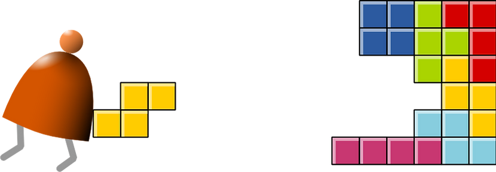

# Nand2Tetris

Repository for my work on the [Nand2Tetris](https://www.nand2tetris.org/) project, as part of KTH's Computer Systems course. It consists of building a modern computer from the ground up, from logic gates to an operating system.

## Summary
- **Languages**: HDL, Hack Assembly, Python, Jack, VM-Language
- **Concepts**: Logic Gates, Memory, CPU, Assembler, Compiler (two-tier), Computer Architecture, Stack, Operating System, 

## Structure
- `myprojects`: Contains all developed code.

